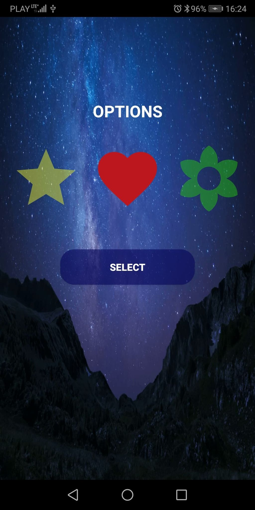

# TouchStar
Simple game created in Kotlin language. First android application (game) created in Kotlin language. The main goal of the game is to get as much points as you can by pressing on falling down icons.
"TouchStar" was made to pracitce:
- Kotlin		- SharedPreferences		- MVVM
- SQLite		- Switcher			- Room
- Animations		- Handlers			- RxKotlin

To play the game, download the file from the link below: 

 

and run it on your device. To play the game your phone has to work under Android system.

Game screens are placed below: 

  
  
  
  
  
  
  

